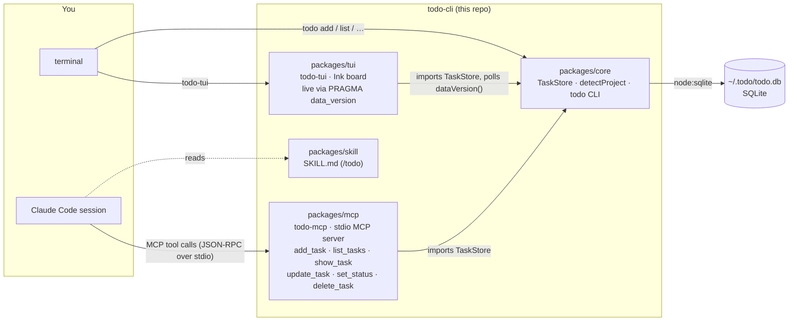
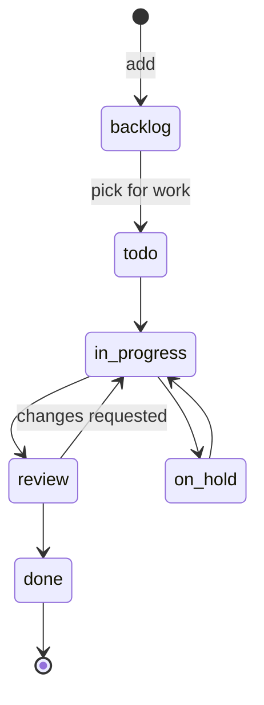

# todo

Project-scoped task manager: a CLI + SQLite core, an MCP server for Claude
Code, and a `/todo` skill. Full product vision in `docs/VISION.md`; this MVP in
`docs/superpowers/specs/2026-08-27-todo-mvp-design.md`.

## System design

Four pieces, one database. `core` knows nothing about AI; `mcp` is a thin
adapter over `core`; the skill is prose that teaches Claude when to call `mcp`.
`tui` is a board over the same file; it polls `PRAGMA data_version` every
250 ms and re-reads when any other connection (MCP, CLI) commits, so changes
made by Claude appear live.



How a call flows:

1. **Project scoping** — both the CLI and the MCP server call
   `detectProject(cwd)`: the git root's basename, or the directory name outside
   a repo. Claude Code launches the MCP server in the session's working
   directory, so tasks are scoped to the repo you are working in without any
   flag. `--project` / `project` overrides; `--all` / `all: true` shows every project.
2. **Storage** — `TaskStore` opens the SQLite file (`TODO_DB` or
   `~/.todo/todo.db`), creates the schema on first use and records a
   `schema_version` so later versions (relations, board) can migrate.
3. **Two front doors, one library** — the CLI and the MCP tools are both thin
   wrappers over `TaskStore`; there is no daemon and the MCP never shells out to
   the CLI. Tests cover the store once and each front door separately.

Task shape and lifecycle:



Any status → any status is allowed (`set_status` only validates the name);
the diagram is the intended flow, which `todo-tui` shows as columns.

| field | type | notes |
|---|---|---|
| `id` | integer | auto |
| `project` | text | from `detectProject` unless overridden |
| `title` | text | short, imperative |
| `description` | text | any length, default `''` |
| `status` | enum | `backlog` (default) · `todo` · `in_progress` · `review` · `on_hold` · `done` |
| `due` | `YYYY-MM-DD` or null | optional |
| `parent_id` | integer or null | set = subtask of that task, one level deep |
| `created_at`, `updated_at` | ISO timestamp | `updated_at` bumps on every write |

**Subtasks** — a task becomes a subtask via `todo add --parent <id>`,
`todo edit <id> --parent <id|none>`, or the MCP `parent_id` argument. One
level only (a subtask cannot have subtasks), a subtask inherits the parent's
project, and deleting a parent deletes its subtasks. `todo list` indents
subtasks under their parent (`↳`), `todo show` prints the parent line and the
subtask list, and the TUI groups them per column, shows `done/total` progress
on the parent card, and adds a subtask with `s`.

## Project structure

pnpm workspace, TypeScript, Node ≥ 24, ESM. Sources import siblings with the
`.ts` extension; Node runs them directly in tests and `tsc` rewrites them to
`.js` in `dist/`.

```
todo-cli/
├── package.json               workspace root — build / test / typecheck across packages
├── pnpm-workspace.yaml
├── tsconfig.base.json         shared compiler options
├── docs/
│   ├── VISION.md              the full product (relations, TUI board, roadmap)
│   └── superpowers/
│       ├── specs/             design specs (this MVP)
│       └── plans/             implementation plans
└── packages/
    ├── core/                  @todo/core — no AI dependencies
    │   ├── src/
    │   │   ├── types.ts       Task, Status, STATUSES, error classes
    │   │   ├── db-path.ts     resolveDbPath(): $TODO_DB or ~/.todo/todo.db
    │   │   ├── store.ts       TaskStore — schema, CRUD over node:sqlite
    │   │   ├── project.ts     detectProject(cwd)
    │   │   ├── description.ts -d flag → piped stdin → $EDITOR; openEditor(initial)
    │   │   ├── watch.ts       watchChanges(store, onChange, ms) — PRAGMA data_version poll
    │   │   ├── format.ts      table / detail rendering for the CLI
    │   │   ├── cli.ts         `todo` binary (commander)
    │   │   └── index.ts       public API consumed by @todo/mcp
    │   └── test/              node:test suites, one per module + CLI (spawned)
    ├── mcp/                   @todo/mcp
    │   ├── src/
    │   │   ├── tools.ts       registerTools(server, store, defaultProject)
    │   │   └── index.ts       `todo-mcp` binary — stdio transport
    │   └── test/tools.test.ts in-memory client ↔ server round-trips
    ├── tui/                   @todo/tui — `todo-tui` Ink board
    │   ├── src/
    │   │   ├── index.tsx      bin — flags, guards, render
    │   │   ├── app.tsx        mode state machine, store actions, watcher, $EDITOR
    │   │   ├── board.tsx · detail.tsx · form.tsx · confirm.tsx
    │   │   ├── board-model.ts columns / selection (pure)
    │   │   ├── keys.ts        key → action per mode (pure)
    │   │   └── date.ts        YYYY-MM-DD validation
    │   └── test/              compiled to dist/ first — Node cannot run JSX
    └── skill/
        └── SKILL.md           the /todo skill (symlinked into ~/.claude/skills)
```

## Install into Claude Code (from source, no marketplace)

Requirements: Node ≥ 24, pnpm, the `claude` CLI. Everything runs from your
clone — no publish step. `<REPO>` below is the absolute path of the clone.

### 1. Build

    git clone git@github.com:fhillipgcastillo/todo-cli.git
    cd todo-cli
    pnpm install && pnpm build

### 2. `todo` and `todo-tui` commands on your PATH (optional, for manual use)

Install globally with **pnpm**, not npm. This repo is a pnpm workspace
(symlinked `node_modules`, `workspace:*` deps), which npm's installer cannot
model — `npm link` aborts with `TypeError: Cannot read properties of null
(reading 'package')`.

First time only, give pnpm a global bin directory and add it to your PATH:

    pnpm setup

Open a **new** terminal so the PATH change applies — `pnpm bin -g` should print
a directory rather than an error — then register each package's bins from
inside its own directory:

    cd packages/core && pnpm add -g . && cd ../..   # todo
    cd packages/tui  && pnpm add -g . && cd ../..   # todo-tui
    todo --version        # 0.1.0
    todo-tui --version    # 0.1.0

(`pnpm link --global` was removed in pnpm 11; `pnpm add -g .` replaces it.)

If a global command looks stale after `pnpm build`, re-run the matching
`pnpm add -g .` to refresh it.

`todo-tui` opens the live board for the current repo; `todo-tui --all` for
every project. Keys: `?` inside the board.

### 3. MCP server (what Claude uses to read/write tasks)

    claude mcp add --scope user todo -- node <REPO>/packages/mcp/dist/index.js
    claude mcp list       # todo: … - ✔ Connected

`--scope user` makes it available in every project. Use `--scope project`
instead to register it for a single repo (writes `.mcp.json` there).

### 4. `/todo` skill (tells Claude when and how to use the tools)

    mkdir -p ~/.claude/skills
    ln -s <REPO>/packages/skill ~/.claude/skills/todo

A symlink, so pulling updates to the repo updates the skill.

### 5. Restart Claude Code and verify

Start a new session inside any git repo, then run `/todo list`. Claude should
call the `list_tasks` tool and answer with the tasks for that repo (empty at
first). `/mcp` shows the `todo` server as connected.

### Uninstall

    claude mcp remove --scope user todo
    rm ~/.claude/skills/todo
    pnpm remove -g @todo/core @todo/tui

### After pulling changes

    pnpm install && pnpm build

The MCP registration and skill symlink point at the clone, so a rebuild is all
that is needed; restart Claude Code to pick up the new server binary.

DB: `~/.todo/todo.db` (`TODO_DB` overrides).

## Use

    todo add "Fix login redirect" -d "repro: ..." --due 2026-09-01
    todo add "Write the repro test" --parent 1
    todo list            # current repo only, subtasks indented under parents
    todo list --all
    todo status 3 in_progress
    todo done 3

## Develop

    pnpm test            # node --test, temp DBs
    pnpm typecheck
